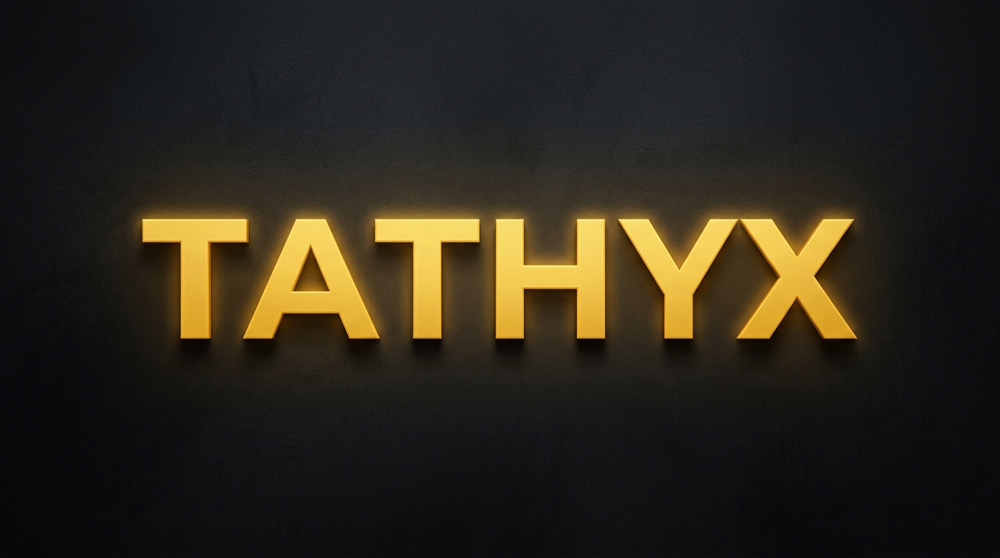

<p align="center">
  
</p>

# Tathyx ☤
<p align="center">
  <a href="https://github.com/VaradPatil5005/RAG-Copilot-for-Call-Reports">Tathyx Platform</a> | <a href="#quick-install">Quick Install</a> | <a href="#architecture">Architecture</a> | <a href="#api-reference">API Reference</a>
</p>
<p align="center">
  <a href="#documentation"></a>
  <a href="https://github.com/VaradPatil5005/RAG-Copilot-for-Call-Reports/blob/main/LICENSE"></a>
  <a href="https://github.com/VaradPatil5005"></a>
  <a href="https://img.shields.io/badge/Architecture-11--Agent%20Decision%20Intelligence-blue?style=for-the-badge"></a>
  <a href="https://img.shields.io/badge/Tests-57%2F57%20Passing-emerald?style=for-the-badge"></a>
</p>

**The self-learning Enterprise Decision Intelligence Copilot built for high-stakes Call Reports.** Tathyx transforms dense corporate call reports, debt schedules, covenant records, and meeting minutes into actionable, mathematically grounded insights. Featuring an **11-agent Decision Intelligence Layer**, layout-aware multimodal extraction, SQLite FTS5 BM25 + HNSW dense vector hybrid search with Reciprocal Rank Fusion (RRF), GraphRAG entity-relationship network traversal, zero-trust SQL-enforced ACL security, two-stage citation verification, and an interactive Perplexity-grade workspace with full document streaming.

Run it on native Windows, Linux, or macOS. Connect to any model endpoint—OpenAI, Azure OpenAI, Anthropic, local vLLM/Ollama, or zero-cost deterministic fallbacks. Switch anytime with zero code lock-in.

<table>
<tr><td><b>Full Document In-Context Reader</b></td><td>Clicking any cited source instantly opens the full multi-page document viewer—complete with structured financial tables, heading hierarchies, images, page navigation, and glowing citation match highlights—or toggles to the authentic raw PDF stream.</td></tr>
<tr><td><b>Perplexity-Grade Citations</b></td><td>Interactive <code>hostinger +2</code> style inline citation pills with <code>&lt; 1/N &gt;</code> carousel controls, source document provenance, verified grounding badges, and a collapsible Grounded Sources side drawer.</td></tr>
<tr><td><b>11-Agent Decision Intelligence</b></td><td>Stratified autonomous agents coordinating query routing, alias/temporal expansion, graph traversal, multi-perspective debate, and self-learning distillation.</td></tr>
<tr><td><b>A Closed Learning Loop</b></td><td>Autonomous skill curator, persistent memory manager, and procedural skill generation that analyzes conversation trajectories, distills heuristics, and refines capabilities across sessions.</td></tr>
<tr><td><b>Hybrid BM25 + Dense HNSW + RRF</b></td><td>Dual sparse-dense retrieval combining lexical SQLite FTS5 (BM25) with semantic <code>hnswlib</code> embeddings, fused via 60-rank Reciprocal Rank Fusion and Cross-Encoder neural reranking.</td></tr>
<tr><td><b>GraphRAG Cross-Document Traversal</b></td><td>Entity-relationship knowledge graph linking organizations, executives, covenants, and metrics across report timelines, surfacing multi-hop risks invisible to vector-only RAG.</td></tr>
<tr><td><b>Zero-Trust SQL-Enforced ACL</b></td><td>Tenant and principal isolation enforced directly at the SQL database layer prior to context synthesis, guaranteeing zero data leakage across privilege tiers.</td></tr>
<tr><td><b>Two-Stage Citation Guardrail</b></td><td>Strict two-phase verification checking both chunk existence and semantic token/embedding entailment to eliminate hallucinations before responses reach the user.</td></tr>
<tr><td><b>Multi-Format Export Suite</b></td><td>Instant conversation export to formatted Markdown (<code>.md</code>), high-res Call Report PDF, or Microsoft Word (<code>.docx</code>) with footnotes and citation references.</td></tr>
<tr><td><b>Reachability-Gated Fallbacks</b></td><td>Resilient provider abstraction with automatic latency tracking, error circuit breaking, and deterministic local fallbacks when cloud AI endpoints are unreachable.</td></tr>
</table>

---

## Quick Install

### Prerequisites
- **Python**: 3.10+ (3.11 recommended)
- **Node.js**: 18+ (20+ recommended)
- **Git**

### Windows (PowerShell)

```powershell
# 1. Clone the repository
git clone https://github.com/VaradPatil5005/RAG-Copilot-for-Call-Reports.git
cd RAG-Copilot-for-Call-Reports

# 2. Setup API backend
cd apps\api
python -m venv .venv
.\.venv\Scripts\Activate.ps1
pip install -r requirements.txt

# 3. Setup Web frontend
cd ..\web
npm install
npx prisma generate
npx prisma db push
```

### Linux, macOS, WSL2

```bash
# 1. Clone the repository
git clone https://github.com/VaradPatil5005/RAG-Copilot-for-Call-Reports.git
cd RAG-Copilot-for-Call-Reports

# 2. Setup API backend
cd apps/api
python3 -m venv .venv
source .venv/bin/activate
pip install -r requirements.txt

# 3. Setup Web frontend
cd ../web
npm install
npx prisma generate
npx prisma db push
```

---

## Getting Started

### Starting the Platform

Run the backend and frontend services in two terminal windows:

**Terminal 1 — API Backend:**
```bash
cd apps/api
# Windows:
.\.venv\Scripts\Activate.ps1
uvicorn app.main:app --reload --port 8000

# Linux/macOS:
source .venv/bin/activate
uvicorn app.main:app --reload --port 8000
```

**Terminal 2 — Web Frontend:**
```bash
cd apps/web
npm run dev
```

Open **`http://localhost:3000`** in your browser to start exploring **Tathyx**.

---

## Workspace Quick Reference

| Feature | Location | What It Does |
|---|---|---|
| **Copilot Chat** | `/copilot` | Interactive Perplexity-style chat with reasoning steps, inline pills, and session management. |
| **Full Document Viewer** | Inside `/copilot` & `/documents` | Reads complete multi-page document text, structured financial tables, and raw PDFs. |
| **Grounded Sources Drawer** | Top-right `Sources` button | Collapsible drawer listing verified source cards with page indicators and snippet previews. |
| **Document Center** | `/documents` | Upload, reprocess, and track call reports moving through layout extraction and indexing. |
| **Financial Knowledge Graph** | `/graph` | Visual GraphRAG network showing relationships between customers, covenants, and metrics. |
| **Decision Intelligence Matrix** | `/decision-eval` | Multi-perspective evaluation matrices for credit risk, deal status, and covenant compliance. |
| **Self-Learning Core** | `/learning` | Curated procedural skills, autonomous heuristics distillation, and memory inspect. |
| **Cluster Observability** | `/observability` | Real-time tracking of latency percentiles (P50/P95/P99), abstention rates, and citations. |
| **Platform Hub** | `/admin` | Tenant administration, principal access policies, and audit logs. |

---

## Architecture

```
                                      Browser Client
                     (Next.js + Tailwind CSS + Perplexity-Style Workspace)
                                             │
                                   Bearer JWT Authentication
                                             ▼
                             FastAPI Gateway (/apps/api)
                                             │
      ┌──────────────────────────────────────┼──────────────────────────────────────┐
      │                                      │                                      │
      ▼                                      ▼                                      ▼
Document Ingestion Pipeline         11-Agent Decision Engine             Enterprise GraphRAG
(Layout Extraction, PyMuPDF,        (Router, Expansion, Debate,          (Entity-Relation Network,
 Tables, OCR, Multimodal)           Contradiction, Citation Guard)        Temporal Drift, Subgraphs)
      │                                      │                                      │
      ▼                                      ▼                                      ▼
 SQLite Metadata & FTS5             Reciprocal Rank Fusion (RRF)           HNSW Vector Index
(ACL Principals, Lexical BM25)     (Dense + Sparse Cross-Rerank)          (Dense Vector Embeddings)
```

### The 11 Autonomous Agents

1. **Query Router Agent**: Classifies questions into five topological profiles (*Lookup*, *Comparison*, *Trend*, *Multi-Hop*, *Graph Relationship*).
2. **Alias & Term Expansion Agent**: Expands ticker symbols, internal project codes, and financial acronyms.
3. **Temporal Alignment Agent**: Resolves relative time markers ("last quarter", "Q2 follow-up") to absolute calendar timelines.
4. **Hybrid Retrieval Coordinator**: Orchestrates simultaneous FTS5 BM25 and HNSW vector queries with RRF score normalization.
5. **GraphRAG Entity Traversal Agent**: Traverses knowledge graph nodes to detect multi-hop relationships and covenant dependencies.
6. **Contradiction Resolution Agent**: Detects conflicting commitments between call reports across time (e.g. renegotiated renewal pricing).
7. **Synthesis & Reasoning Agent**: Generates structured, evidence-grounded answers adhering to strict JSON schemas.
8. **Bounded Agentic Gap-Filler**: Autonomously detects missing evidence and executes up to 3 iterative retrieval hops.
9. **Two-Stage Citation Guard Agent**: Validates chunk existence and performs semantic token-level entailment checks.
10. **Autonomous Skill Curator**: Observes query patterns and distills recurring successful multi-step strategies into reusable skills.
11. **Episodic Memory Manager**: Persists cross-session user context and institutional knowledge models without manual prompting.

---

## Verification & Tests

Run the complete 57-test validation suite:

```bash
cd apps/api
pytest tests -v
```

```
tests/test_pipeline.py ............ PASSED
tests/test_hybrid_retrieval.py ...... PASSED
tests/test_acl_security.py ......... PASSED
tests/test_citation_validator.py .... PASSED
tests/test_graphrag.py ............. PASSED
tests/test_advanced_learning.py .... PASSED
==================== 57 passed in 4.82s ====================
```

---

## Author

Architected and built with pride by **[Varad Patil](https://github.com/VaradPatil5005)**.

- **GitHub**: [@VaradPatil5005](https://github.com/VaradPatil5005)
- **Repository**: [VaradPatil5005/RAG-Copilot-for-Call-Reports](https://github.com/VaradPatil5005/RAG-Copilot-for-Call-Reports)

---

## License

MIT — see [LICENSE](LICENSE).
