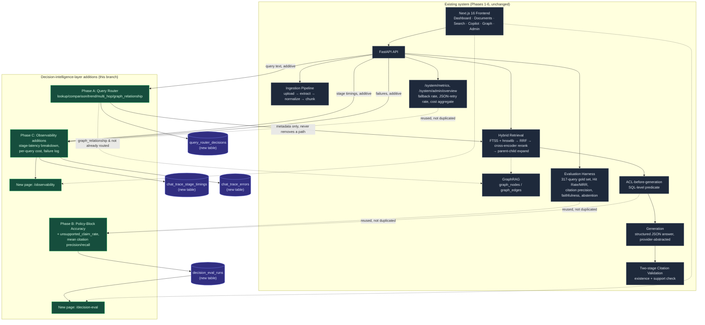

# Decision Intelligence Copilot — additive layer (feature/decision-intelligence-layer)

Net-new positioning doc. Doesn't edit `README.md` (see
[Proposed README diff](#proposed-readme-diff-not-applied) at the bottom —
a patch file for manual review, not auto-applied).

## Framing

The existing README positions this project as a **RAG copilot for call
reports**: ask a question, get a grounded, cited answer. Everything below
is an *additive layer* on top of that — it doesn't change what the
copilot answers, only what the system understands about the question
before answering it, how confidently the team can say the answers are
trustworthy, and how observable the system is in production. Framed as a
"decision intelligence copilot": the same grounded-answer core, plus
(a) query-shape awareness, (b) a measured trust posture (including where
ACL enforcement's real-world outcome has and hasn't held), and (c)
production visibility into cost, latency, and failure modes.

None of that reframing changes a single existing API contract, SSE event
shape, or database column. It's additive in the same literal sense the
code changes are: new modules, new tables, new routes, new pages.

## What's new, by phase

| Phase | What | Code |
|---|---|---|
| A | Query Router — classifies each query into lookup / comparison / trend / multi_hop / graph_relationship; heuristic-first, LLM fallback only when ambiguous and reachable; logged per-trace; additively merges GraphRAG evidence for graph-shaped queries the existing intent classifier didn't already route there | `app/routing/query_router.py`, wired into `app/routers/copilot.py` |
| B | Policy-block accuracy (genuinely new metric) + an `unsupported_claim_rate` / `mean_citation_precision` / `mean_citation_recall` aggregate added to the existing full-benchmark harness | `app/evaluation/policy_eval.py`, `app/evaluation/policy_gold_queries.py`, additive fields in `app/evaluation/full_benchmark.py`, `app/routers/decision_eval.py` |
| C | Retrieval-stage latency breakdown, per-query cost, and a persisted failure/error log (none of these three existed before) | `app/observability/instrumentation.py`, `app/observability/dashboard.py`, `app/routers/observability.py` |
| D | This doc | `docs/decision-intelligence-copilot.md` |

## What already existed and was deliberately NOT rebuilt

Read-the-repo-first (per this branch's own hard constraints) turned up
more overlap than expected. Documenting it here so a future maintainer
doesn't accidentally "clean up" what looks like a gap:

- **Citation precision, faithfulness, semantic relevancy, abstention
  accuracy, hit rate, MRR, confidence intervals** — all already computed
  per-query in `app/evaluation/quality_metrics.py` and aggregated in
  `app/evaluation/full_benchmark.py`. Phase B only *added* two things
  that were missing: an `unsupported_claim_rate` aggregate (the number
  existed per-trace via `citation_validator.ValidationResult.summary`,
  but was never rolled up across a benchmark run) and a
  `mean_citation_precision`/`mean_citation_recall` aggregate (computed
  per-query already, never averaged).
- **GraphRAG, ACL-before-generation, two-stage citation validation,
  abstention** — all fully built (Phase 6). The Query Router's
  `graph_relationship` category *calls* the existing GraphRAG evidence
  path; it does not reimplement graph traversal.
- **Fallback-provider rate, JSON-retry rate, abstention rate,
  citation-validation pass rate, latency percentiles, aggregate cost by
  model/day/tenant, admin overview** — all already served by
  `app/routers/system.py`'s `/system/metrics` and
  `/system/admin/overview`, built in Phase 6.6. Phase C's
  `/observability/dashboard` *calls* `system.metrics()` directly for
  this section rather than recomputing it, and only adds the three
  things that were genuinely missing: stage-level latency breakdown,
  per-query (not just aggregate) cost, and a persisted failure log.

## Architecture

Existing architecture (unchanged) plus this branch's additive layer,
called out separately:



Dashed arrows mark "reused directly, not reimplemented" or "conditional/
advisory only" relationships — the two things this branch's hard
constraints cared about most: never bypass an existing path, never
duplicate an existing system.

## New API surface

| Route | Method | Phase | Notes |
|---|---|---|---|
| `/decision-eval/policy-gold-set` | GET | B | the new gold cases |
| `/decision-eval/run-policy-block` | POST | B | runs + persists |
| `/decision-eval/latest-policy-block` | GET | B | read-only |
| `/decision-eval/summary` | GET | B | read-only, combines with the existing `/evaluation/run-full` report |
| `/observability/stage-latency` | GET | C | |
| `/observability/cost-per-query` | GET | C | |
| `/observability/errors` | GET | C | |
| `/observability/dashboard` | GET | C | combines the above with the existing `/system/metrics` |

All eight are new routes on new router files, registered alongside (never
replacing) `main.py`'s existing `include_router` calls.

## New database tables

`query_router_decisions`, `decision_eval_runs`,
`chat_trace_stage_timings`, `chat_trace_errors` — four new tables, zero
new columns on any existing table (`chat_traces`, `evaluation_runs`,
etc. are byte-for-byte unchanged). See `app/db.py`'s `SCHEMA` string for
the exact DDL and the comment above each block explaining why a new
table was chosen over an `ALTER TABLE`.

## Testing status (as of this doc)

Three new isolated test files (`test_query_router.py`,
`test_decision_eval.py`, `test_observability.py`), none of which modify
the existing 57. Every new module's core logic was verified standalone
(with `hnswlib`/`fastapi` stubbed where the sandbox that built this had
no network access to install them) against real SQLite and simulated
ACL scenarios, including a deliberately "leaking" ACL simulation to
confirm `policy_block_accuracy` actually catches a regression rather
than always reporting green.

**This has not yet been run through the project's real `pytest` suite
end-to-end** (no network in the build sandbox to install `fastapi` /
`pytest` / `hnswlib`). Before merging:

```bash
cd apps/api
pytest -v                              # existing 57 — must be unaffected
pytest -v tests/test_query_router.py tests/test_decision_eval.py tests/test_observability.py
```

## Proposed README diff (not applied)

A patch file — `docs/decision-intelligence-copilot.readme.patch` — adds
one short paragraph after the existing "Detailed Architecture" section,
pointing at this doc, without touching the existing ASCII diagram or any
other line. Apply it yourself with:

```bash
git apply docs/decision-intelligence-copilot.readme.patch
```

It is **not** applied in this branch — per the master prompt's Phase D
instruction, README changes are proposed only, for manual review.
